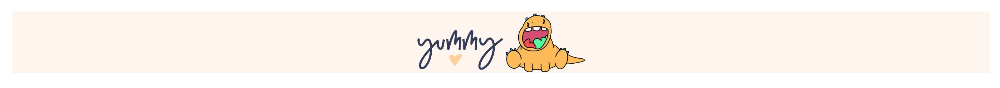
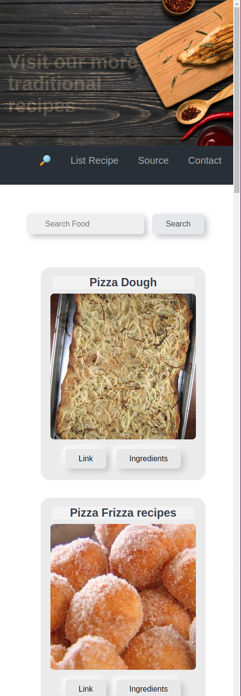

# Food Recipe Api (React Hooks)
</a>
 🍓 Api  →  <a> https://www.edamam.com/ </a> 

______

</a> 

#

</a>
&nbsp &nbsp &nbsp 
</a>

#

🫐 In the project directory, you can run:
  - Clone git https://github.com/Davina-dev/FoodRecipeApi-Hooks to download the project, do a fork.
 - `npm install`
 - `npm run dev`
  - Open [http://localhost:3000](http://localhost:3000) to view it in your browser.

🍇 Install 

- axios
- react-router-dom
- uuid

___
 ⌨️ with ❤️ by [Davina](https://www.linkedin.com/in/davinamedina/) 😊
